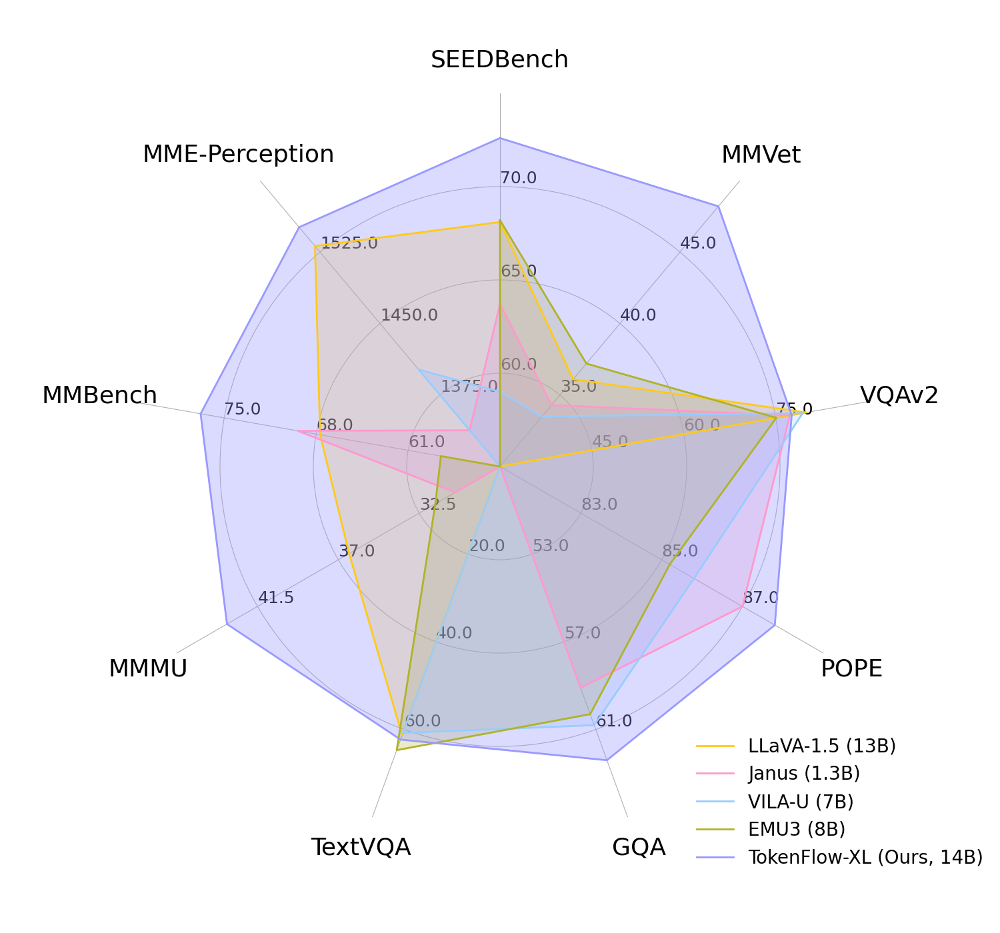

# TokenFlow🚀: Unified Image Tokenizer for Multimodal Understanding and Generation

&nbsp;
&nbsp;
&nbsp;

## 🌿 Introduction

We present TokenFlow, a unified image tokenizer that bridges the long-standing gap between multimodal understanding and generation. 
TokenFlow introduce an innovative dual-codebook architecture that decouples semantic and pixel-level feature learning while maintaining their alignment through a shared mapping mechanism. 

TokenFlow excels in both multimodal understanding and image generation. For multimodal understanding, we surpass the flagship models such as LLaVA-1.5 and EMU3 by a large margin. For text-to-image generation, we also achieve comparable performance to SDXL in 256×256 resolution.

## 📰 News

**2024.12.5**:  🎉🎉🎉 TokenFlow is released! 🎉🎉🎉  See our [project page](https://byteflow-ai.github.io/TokenFlow/) and [paper]() .

## 🤗 Checkpoints(coming soon)

**Text-to-Image Model**

| Model Size   | Tokenizer Weight       | Model Weight |
| ------------ | --------------         | ------------------|
| 7B           | [TokenFlow](https://huggingface.co/ByteFlow-AI/TokenFlow) | [TokenFlow-t2i](https://huggingface.co/ByteFlow-AI/TokenFlow-t2i) |

**Multimodal Understanding Model**

| Language Backbone   | Tokenizer Weight       | Model Weight |
| ------------ | --------------         | ------------------|
| Qwen-2.5-14B           | [TokenFlow-XL](https://huggingface.co/ByteFlow-AI/TokenFlow) | [TokenFlow-i2t](https://huggingface.co/ByteFlow-AI/TokenFlow-i2t) |

## 📑 Open-source Plan

- [ ] Release the checkpoint of tokenizer, text-to-image model & multimodal understanding model.
- [ ] Release the training & inference code for tokenizer.
- [ ] Release the training & inference code for text-to-image generation.
- [ ] Release the training & inference code for multimodal understanding.
- [ ] Release the single-scale version of TokenFlow.

## Acknowledgement

We thank the great work from [VAR](https://github.com/FoundationVision/VAR), [LlamaGen](https://github.com/FoundationVision/LlamaGen) and [LLaVA](https://github.com/haotian-liu/LLaVA).

